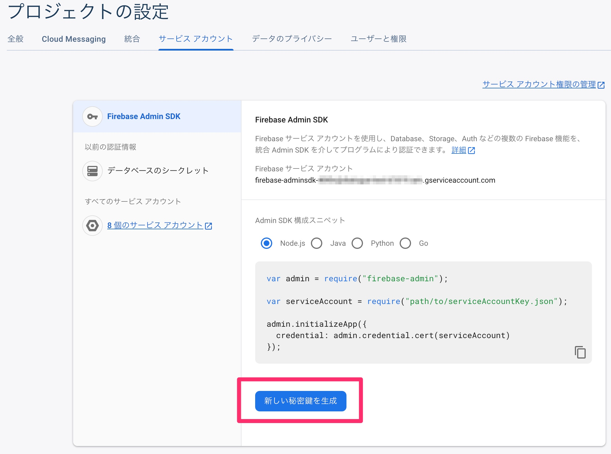

## Preparation:

Place the secret key (json) of the Firebase service account, which is generated in the Firebase Console project, into this directory.



```sh
$ cp path/to/serviceAccountKey.json sample-app-firebase-adminsdk-foobar.json
```

This program ues the following modules:

- argparse
- json
- requests
- oauth2client

If the required modules are not installed, please install them using the command below:

```sh
$ pip install argparse json requests oauth2client
```

## Example:

Ensure you have obtained the device token of the desired recipient device.

Send a push notification by specifying the target device's token using the -d option.

```sh
$ python send_test.py -d d9pCrwUARmCyWDRjumG2SS:APA91xxxx 
=== Request ===
Request message:  {
    "message": {
        "token": "d9pCrwUARmCyWDRjumG2SS:APA91xxxxx",
        "notification": {
            "title": "Test Notification",
            "body": "This is a sample notification"
        }
    }
}

=== Response ===
Response status code:  200
Response content:  {
  "name": "projects/sample-app/messages/0:1692853925636648%d2dadecfd2dadecf"
}
```

## Command Options:

- `-d DEVICE_TOKEN, --device-token DEVICE_TOKEN`: Specify the device token.
- `-p PRIVATE_KEY_JSON_FILE, --private-key-json-file PRIVATE_KEY_JSON_FILE`: Specify the secret key of the Firebase service account.
- `-m MESSAGE_JSON, --message-json MESSAGE_JSON`: Specify the json file of the push notification message to be sent.
- `-t TITLE, --title TITLE`: Specify title to set for the push notification.
- `--print-access-token`: Display the bearer token used for FCM HTTP v1 protocol.


## Reference Site:
- Firebase Cloud Messaging REST API
  - https://firebase.google.com/docs/reference/fcm/rest/v1/projects.messages
- Migrate from legacy FCM APIs to HTTP v1
  - https://firebase.google.com/docs/cloud-messaging/migrate-v1